<picture>
  <source media="(prefers-color-scheme: dark)" srcset="dark.svg">
  <source media="(prefers-color-scheme: light)" srcset="light.svg">
  
</picture>
<div align="center">
  

  

  <br />

  <!-- Academic & Location Badges -->
  
  

  <br /><br />

  <!-- Social & Connection Buttons -->
  <a href="https://vortex4047.github.io/"></a>
  <a href="https://linkedin.com/in/kritiksaha"></a>
  <a href="mailto:kritik.saha@gmail.com"></a>
  <a href="https://github.com/Vortex4047"></a>

  <br /><br />

  <!-- GitHub Statistics Badges -->
  
  
  
</div>

<br />

---

### ✦ About Me

I am a **Software Engineer** focusing on high-performance backend systems, full-stack architecture, and applied machine learning. With a strong foundation in computer science and engineering, I specialize in translating complex algorithms into scalable, enterprise-grade applications. 

My engineering philosophy centers around a **product-first mindset**—building robust, maintainable solutions that deliver measurable impact. Whether architecting database schemas, deploying microservices, or developing AI models, I prioritize system integrity, performance optimization, and clean code architecture.

**Open To:** Software Engineering Roles • AI/ML Engineering Positions • Research Internships • Open Source Collaborations

---

### ✦ Tech Stack

**Programming Languages**  
<a href="https://skillicons.dev"></a>

**Frontend Architecture**  
<a href="https://skillicons.dev"></a>

**Backend & Databases**  
<a href="https://skillicons.dev"></a>

**Cloud, DevOps & Tooling**  
<a href="https://skillicons.dev"></a>

---

### ✦ AI / ML Expertise

| Domain | Proficiency | Details |
| :--- | :--- | :--- |
| **Predictive Modeling** | Advanced | Designing and deploying supervised learning models for data classification and continuous prediction algorithms. |
| **Data Processing** | Advanced | High-volume data pipeline engineering, feature extraction, and mathematical optimizations (NumPy, Pandas, Scikit-learn). |
| **Generative AI Integration** | Intermediate | Integrating LLMs into applications for intelligent automated assistance and real-time natural language processing. |
| **Computer Vision** | Intermediate | Implementation of convolutional neural networks (CNNs) for image classification and spatial data analysis. |

---

### ✦ Featured Projects

<details>
  <summary><b>▸ Full-Stack GitHub Analytics Dashboard</b></summary>
  <br />
  A comprehensive, high-performance web application designed to visualize a developer's coding journey by deeply integrating with the GitHub REST API and GraphQL infrastructure.

  | Attribute | Details |
  | :--- | :--- |
  | **Stack** | TypeScript, React.js, Node.js, Express, Chart.js |
  | **Scale** | Multi-user capable, handling concurrent external API polling |
  | **Performance** | Optimized rendering of large datasets with state-caching mechanisms |
  | **Security** | Implemented secure token handling and OAuth constraints |
  | **Impact** | Provides granular insights into developer productivity and code patterns |
  | **Repository** | [View Source Code](https://github.com/Vortex4047) |

  *Professional Context:* Architected the entire system from the ground up, focusing heavily on asynchronous state management and decoupling the backend data ingestion services from the frontend visualization layers to ensure maximum responsiveness.
</details>

<details>
  <summary><b>▸ Enhanced Code Helper Pro</b></summary>
  <br />
  An intelligent, desktop-based development assistant that leverages artificial intelligence to analyze, debug, and optimize codebase structures across multiple programming languages.

  | Attribute | Details |
  | :--- | :--- |
  | **Stack** | Python, Tkinter, AI Inference APIs |
  | **Scale** | Standalone enterprise desktop utility |
  | **Performance** | Low-latency response processing with asynchronous I/O |
  | **Security** | Local execution environment with encrypted API key management |
  | **Impact** | Significantly reduces debugging time and standardizes code quality |
  | **Repository** | [View Source Code](https://github.com/Vortex4047) |

  *Professional Context:* Engineered a robust graphical user interface using Tkinter, integrating seamless dynamic AI model selection. Focused on creating an intuitive developer experience while maintaining strict error handling and system stability.
</details>

---

### ✦ Experience

**Software Developer Intern** | **Atlys Nexus Innovations**  
*Python Developer Internship Program*  
• Developed and maintained modular Python scripts for internal toolchains.  
• Collaborated with engineering teams to optimize backend data flow and script execution times.  
• `Python` `Backend Engineering` `Data Structures` `API Integration`

**Technical Intern** | **Ziventra**  
*Engineering & Development*  
• Participated in full-lifecycle software development tasks including requirements gathering, coding, and testing.  
• Assisted in deploying system updates and refining core logic modules.  
• `Software Architecture` `Agile Methodologies` `Version Control`

**TCS NextStep Program** | **Tata Consultancy Services**  
*Trainee / Program Participant*  
• Engaged in enterprise-level software engineering paradigms and corporate technical workflows.  
• Mastered foundational IT frameworks and large-scale system deployment methodologies.  
• `Enterprise IT` `System Analysis` `Problem Solving`

---

### ✦ Achievements

| Recognition | Details |
| :---: | :--- |
| **Winner, Coder's Feud** | Secured 1st place in the competitive coding event organized by MUJ ACM. Demonstrated superior algorithmic problem-solving and optimization skills under time constraints. |
| **Participant, Kagglethon** | Competed in a rigorous 24-hour overnight hackathon focused on machine learning and predictive data modeling. |

---

### ✦ Certifications

**AWS (Amazon Web Services)**  


**Oracle**  


**NPTEL**  


**Cisco**  


---

### ✦ Coding Profiles

<div align="center">
  <a href="https://leetcode.com/"></a>
  <a href="https://auth.geeksforgeeks.org/"></a>
  <a href="https://www.hackerrank.com/"></a>
  <a href="https://www.codechef.com/"></a>
</div>

---

### ✦ GitHub Analytics

<p align="center">
  
  
</p>

<br />

<p align="center">
  
</p>

---

### ✦ GitHub Trophies

<p align="center">
  
</p>

---

### ✦ Contribution Activity

<div align="center">
  
</div>

---

### ✦ Contribution Snake

<div align="center">
  <a href="https://github.com/Vortex4047">
    
  </a>
</div>
---

### ✦ Current Focus

```yaml
profile_status:
  learning: 
    - "Advanced Distributed Systems"
    - "Cloud-Native Architecture (Kubernetes, Terraform)"
  building:
    - "Scalable Microservices with Node.js & TypeScript"
    - "AI-driven developer productivity tools"
  exploring:
    - "Large Language Model (LLM) fine-tuning"
    - "Vector Databases & Semantic Search"
  open_to:
    - "Full-Time Software Engineering Opportunities"
    - "Research & Development Internships"
